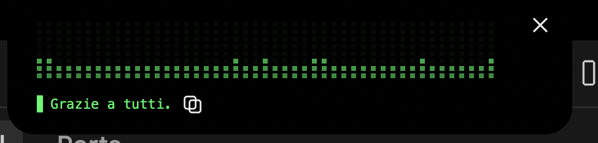

<h1 align="center">VibeVoice</h1>

<p align="center">
  <strong>A Matrix-green Dynamic Island for your voice.</strong><br>
  Live speech-to-text in your Mac's notch — dictate, and your words land where the cursor is.
</p>

<p align="center">
  
</p>

<p align="center">
  <a href="LICENSE"></a>
  
  
  
  
</p>

---

## Table of Contents

- [What it is](#what-it-is)
- [Features](#features)
- [Requirements](#requirements)
- [Install](#install)
- [Usage](#usage)
- [Architecture](#architecture)
- [Auto-start (LaunchAgent)](#auto-start-launchagent)
- [Configuration](#configuration)
- [Troubleshooting](#troubleshooting)
- [FAQ](#faq)
- [Roadmap](#roadmap)
- [Contributing](#contributing)
- [License](#license)
- [Credits](#credits)

---

## What it is

VibeVoice is a Dynamic Island that lives in your Mac's notch and transcribes your
voice in real time with `whisper-turbo`, then automatically pastes the text into
the frontmost app. Speak, watch the Matrix-green waveform react, and your words
land exactly where the cursor is — no clicks, no copy-paste dance.

It's purpose-built for **live coding with Claude Code**: keep your hands on the
keyboard, dictate the next instruction, and let VibeVoice drop it straight into
the terminal (with an optional auto-Return so the prompt fires the moment you
stop talking).

## Features

- **Matrix pixel waveform** — a live, retro-green RMS waveform rendered in the notch.
- **Immediate onset** — the pill reacts the instant you start speaking; silence makes it disappear.
- **Universal autosend (CGEvent)** — pastes into *any* frontmost app via synthetic
  keyboard events, no app-specific integration required.
- **One-shot auto-Return daemon** — an optional `autosend.py` that presses Return
  for you after dictation settles. Armed with `Cmd+Shift+Space`, fires once, then
  disarms itself — with window-level locking so it never fires into the wrong window.
- **Inline copy (⧉)** — one tap copies the last transcription to the clipboard.
- **Menu bar toggle** — a 🎙 menu bar item flips dictation on/off at any time.
- **Hides on silence** — the island stays out of your way until you speak again.

## Requirements

- **macOS 12+** (a Mac with a notch is recommended — that's where the island lives).
- **Python 3.10+**
- Python packages: **PyObjC**, **mlx-whisper**, **sounddevice**, **numpy**
  (plus **pynput** if you use the optional `autosend.py` daemon).
- System permissions:
  - **Microphone** access (System Settings → Privacy & Security → Microphone).
  - **Accessibility** access for synthetic keystrokes / autosend
    (System Settings → Privacy & Security → Accessibility).

## Install

```bash
git clone https://github.com/mattiacalastri/vibevoice.git
cd vibevoice
pip install -r requirements.txt

# Start the engine (mic capture + STT, writes state files)
python3 engine.py &

# Start the pill (Dynamic Island UI, reads state files)
python3 vibevoice.py &
```

> **First run:** macOS will prompt for **Microphone** and **Accessibility**
> permissions. Grant both to the app you launch from (Terminal, iTerm2, etc.) —
> see [Troubleshooting](#troubleshooting) if the pill stays invisible or text
> doesn't paste.

## Usage

1. **Speak** — start talking; the island appears in the notch.
2. **Transcribe** — the Matrix waveform reacts live while `whisper-turbo` works.
3. **Autosend** — when you stop, the text is pasted into the frontmost app
   (optionally followed by Return — see [Configuration](#configuration)).
4. **⧉ Copy** — tap the inline copy glyph to put the last transcription on the clipboard.
5. **✕ / menu bar** — dismiss the pill with ✕, or use the **🎙** menu bar item to
   toggle dictation on/off.

## Architecture

```
   🎤 mic
    │
    ▼
┌─────────────┐   writes    ┌──────────────────┐   reads    ┌──────────────┐
│  engine.py  │ ──────────▶ │  ~/.vibevoice/   │ ◀───────── │ vibevoice.py │
│  capture +  │   state     │  state · levels  │   state    │  the pill /  │
│  whisper    │   files     │  raw.txt         │   files    │  Dynamic Is. │
└─────────────┘             └──────────────────┘            └──────────────┘
       │                                                            │
       │ paste text into frontmost app                              │ draws
       ▼                                                            ▼
┌──────────────────────────────────┐                         📺 the notch
│  autosend.py  (optional daemon)  │  presses Return after typing settles
│  Cmd+Shift+Space · one-shot      │  — armed, fires once, disarms itself
└──────────────────────────────────┘
```

VibeVoice is split into **decoupled processes** that communicate only through a
small set of files under `~/.vibevoice/`:

- **`engine.py`** — captures the microphone, runs STT, and **writes** the state files.
- **`vibevoice.py`** — the pill / Dynamic Island UI. It **reads** the state files
  and draws the waveform, transcription, and controls.
- **`autosend.py`** *(optional)* — a standalone daemon that presses Return after
  you stop typing/dictating. It shares nothing with the engine except the
  optional pause flag, so you can run it with any STT (or not at all).

Because the only contract between them is the state directory, you can
**bring your own engine**: swap `engine.py` for anything that respects the
contract below, and the pill keeps working unchanged.

### Two ways to fire the prompt

Pressing Return after the text lands has two independent paths — use whichever
fits:

1. **Engine-driven (simple).** Set `VIBEVOICE_AUTOSEND_RETURN=1` and the engine
   presses Return right after it pastes. Zero extra processes.
2. **Daemon-driven (`autosend.py`, robust).** A global keystroke listener that
   fires Return only after typing goes quiet, **armed one-shot** via
   `Cmd+Shift+Space`, with window-signature locking so a delayed Return can't
   land in a window you switched to. Best when you dictate into a terminal/editor
   and want a hard guarantee the Return won't misfire.

### State-file contract (shared pill ↔ engine)

The engine **writes** these files; the pill **reads** them. Honor this contract
exactly.

- **State directory:** `~/.vibevoice/` — expand `$HOME`, create it if missing.
- **`~/.vibevoice/state`** — a text file containing exactly **one** of:
  `idle` | `recording` | `transcribing`
- **`~/.vibevoice/levels.bin`** — **60 `float32`** values, **little-endian**
  (RMS levels in the `0..1` range). Must be written **atomically**
  (write to a temp file, then `os.replace`).
- **`~/.vibevoice/raw.txt`** — the last transcription as **plain text**
  (just the sentence — no logs, no timestamps).
- **`~/.vibevoice/autosend`** *(written by `autosend.py` only)* — `on` | `off`,
  the armed state of the auto-Return daemon. Independent of the pill/engine.

### Auto-send daemon (`autosend.py`)

Optional, standalone. It listens to global keystrokes (`pynput`) and, while a
target app is frontmost, presses Return once typing has been quiet for
`--delay` seconds (default `0.8`).

- **Arm / disarm:** `Cmd+Shift+Space` — *tink* = armed, *submarine* = disarmed,
  plus a desktop notification when armed.
- **One-shot:** after the first Return fires it disarms itself, so it never
  presses Return while you type by hand afterwards.
- **Window lock:** it snapshots the frontmost window and skips the send if you
  switched windows during the silence window.
- **External pause:** write a unix timestamp into `/tmp/vibevoice_autosend_pause`
  to suspend it (auto-clears after 60s); delete the file to resume.

```bash
pip install pynput
python3 autosend.py            # then arm with Cmd+Shift+Space and dictate
python3 autosend.py --delay 3  # wait 3s of silence before pressing Return
```

Needs **Accessibility** permission for the app that launches it (it reads global
keys and simulates Return).

## Auto-start (LaunchAgent)

A LaunchAgent template is included as **[`com.vibevoice.pill.plist`](com.vibevoice.pill.plist)**
(`RunAtLoad` + `KeepAlive`). It runs `python3 ~/projects/vibevoice/vibevoice.py`
on login and keeps it alive.

The template uses a `__HOME__` placeholder — **replace it with your absolute home
directory path** (e.g. `/Users/yourname`) before installing:

```bash
cp com.vibevoice.pill.plist ~/Library/LaunchAgents/
# edit the copy: replace every __HOME__ with your home path
launchctl load ~/Library/LaunchAgents/com.vibevoice.pill.plist
```

To also auto-start the one-shot auto-Return daemon, install
**[`com.vibevoice.autosend.plist`](com.vibevoice.autosend.plist)** the same way:

```bash
cp com.vibevoice.autosend.plist ~/Library/LaunchAgents/
# edit the copy: replace every __HOME__ with your home path
launchctl load ~/Library/LaunchAgents/com.vibevoice.autosend.plist
```

## Configuration

Behavior is controlled by environment variables read by `engine.py`:

| Variable                     | Default                          | Description                                                        |
| ---------------------------- | -------------------------------- | ------------------------------------------------------------------ |
| `VIBEVOICE_LANG`             | `it`                             | Whisper transcription language code (e.g. `en`, `it`, `de`, `fr`). |
| `VIBEVOICE_MODEL`            | `mlx-community/whisper-turbo`    | The `mlx_whisper` model to load.                                   |
| `VIBEVOICE_AUTOSEND`         | `1`                              | `1` to auto-paste into the frontmost app, `0` to copy only.        |
| `VIBEVOICE_AUTOSEND_RETURN`  | `0`                              | `1` to press Return right after pasting (fires the prompt), `0` to skip. |

```bash
# Example: English, copy-to-clipboard only, no auto-Return
VIBEVOICE_LANG=en VIBEVOICE_AUTOSEND=0 python3 engine.py
```

## Troubleshooting

| Symptom | Fix |
| ------- | --- |
| **Pill never appears** | The engine isn't running or lacks **Microphone** access. Check `python3 engine.py` output and System Settings → Privacy & Security → Microphone. |
| **Transcription works but text doesn't paste** | Missing **Accessibility** permission for the launching app. Add Terminal/iTerm2 under Privacy & Security → Accessibility, then restart it. |
| **Auto-Return fires into the wrong window** | Use the `autosend.py` daemon instead of `VIBEVOICE_AUTOSEND_RETURN` — it locks onto the window you dictated into. |
| **`autosend.py` does nothing when I dictate** | It's one-shot: arm it first with **`Cmd+Shift+Space`** (you'll hear *tink* + a notification). It disarms after one send. |
| **Wrong language transcribed** | Set `VIBEVOICE_LANG` (default is `it`). |
| **`ModuleNotFoundError: pynput`** | `pip install pynput` — only needed for the optional `autosend.py` daemon. |

## FAQ

**Do I need a Mac with a notch?**
No — the pill renders under the notch area, but it works on any macOS 12+ display. A notch just makes it feel native.

**Does it send my audio anywhere?**
No. Transcription runs **locally** via `mlx-whisper` on Apple Silicon. Nothing leaves your machine.

**Can I use a different STT engine?**
Yes. The pill only reads the [state-file contract](#state-file-contract-shared-pill--engine). Swap `engine.py` for anything that writes those files.

**Is it only for Claude Code?**
No. It pastes into *any* frontmost app — terminal, editor, chat box, browser field. Claude Code is just the workflow it was born for.

## Roadmap

This is **v0.x** — it works end to end (capture → transcribe → paste → send). Planned:

- [ ] Packaged `.app` bundle (no manual `pip` / LaunchAgent editing)
- [ ] Configurable theme (beyond Matrix green)
- [ ] In-pill language switcher
- [ ] Demo GIF + short screencast
- [ ] Optional streaming partial transcripts

Ideas and PRs welcome — see [Contributing](#contributing).

## Contributing

Contributions are welcome. Open an issue to discuss a change, or send a PR:

```bash
git clone https://github.com/mattiacalastri/vibevoice.git
cd vibevoice
pip install -r requirements.txt
# make your change, test engine.py + vibevoice.py + autosend.py, then open a PR
```

Keep the **state-file contract** stable — it's the seam that lets people bring
their own engine. If you change it, document it in the same PR.

## License

[MIT](LICENSE) — Copyright (c) 2026 Mattia Calastri.

## Credits

Built with Claude Code (Opus) + Mattia Calastri.
