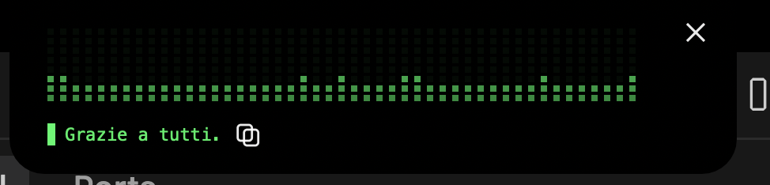
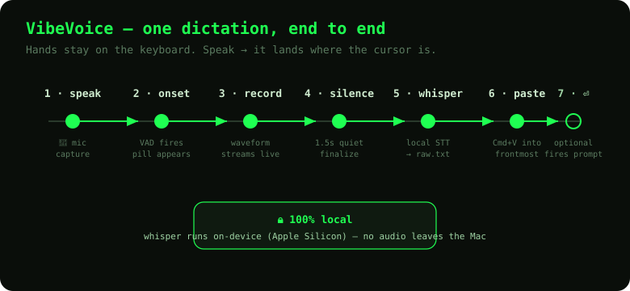
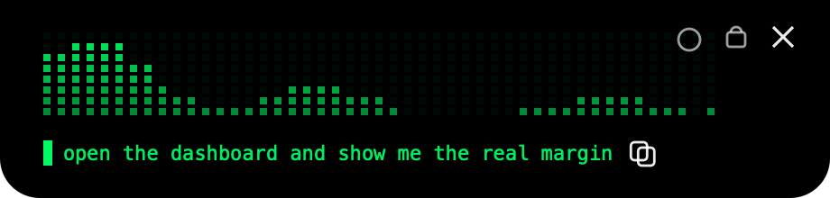
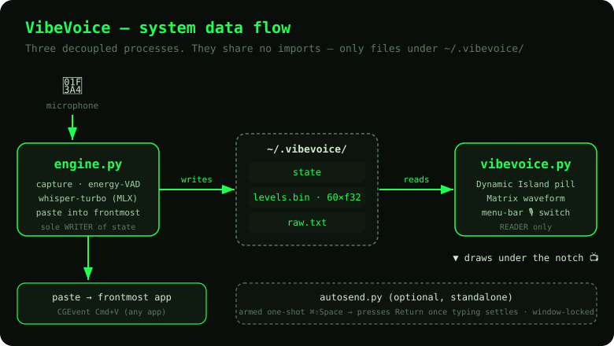
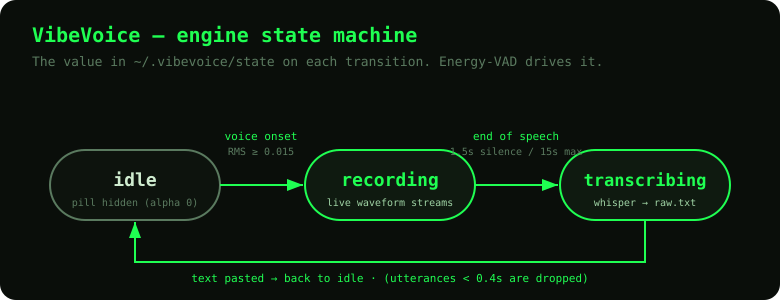

<h1 align="center">VibeVoice</h1>

<p align="center">
  <strong>You talk. It types.</strong><br>
  A Matrix-green Dynamic Island for your voice — live, on-device speech-to-text
  in your Mac's notch, landing exactly where your cursor is.
</p>

<p align="center">
  
</p>

<p align="center">
  <a href="https://github.com/mattiacalastri/vibevoice/actions/workflows/ci.yml"></a>
  <a href="https://github.com/mattiacalastri/vibevoice/releases/latest"></a>
  <a href="LICENSE"></a>
  
  
  
</p>

<p align="center">
  <sub>
    <a href="#quickstart">Quickstart</a> ·
    <a href="#why">Why</a> ·
    <a href="#what-it-does">What it does</a> ·
    <a href="#the-numbers">The numbers</a> ·
    <a href="#install">Install</a> ·
    <a href="#architecture">Architecture</a> ·
    <a href="#configuration">Configuration</a> ·
    <a href="#troubleshooting">Troubleshooting</a> ·
    <a href="#for-students--for-agents">Students & agents</a>
  </sub>
</p>

---

## Quickstart

1. Download **[`VibeVoice.dmg`](https://github.com/mattiacalastri/vibevoice/releases/latest)** and drag the app to Applications.
2. First launch: **right-click → Open** (signed, not yet notarized — Gatekeeper asks once), then grant **Microphone** and **Accessibility** when macOS prompts.
3. Put your cursor anywhere — a terminal, an editor, a chat box — and **speak**.

The pill lights up in the notch, the words appear *while you're still talking*,
and the finished sentence lands where your cursor is. No clicks, no copy-paste.

> [!TIP]
> Dictating into **Claude Code**? Arm the auto-Return with <kbd>⌘</kbd><kbd>⇧</kbd><kbd>Space</kbd>
> and the prompt fires the moment you stop talking. Think out loud, ship.

## Why

[Vibe coding](https://en.wikipedia.org/wiki/Vibe_coding) — Karpathy's term for
describing what you want in plain language and letting an AI agent write the
code — moved the bottleneck. It's no longer syntax. It's **how fast you can
express intent**.

Typing is the friction. VibeVoice removes it: hands resting, you *talk* to your
agent, and the instruction is in the terminal the instant you stop — optionally
already submitted. It's the missing input device for vibe coding.

Born for **Claude Code**, but it types into *any* frontmost app.

## What it does

- **Live text while you talk.** The open utterance is re-decoded continuously and
  a word is shown only once two successive passes agree on it (LocalAgreement-2) —
  the draft grows steadily, never flickers, and never un-says something you've
  already read.
- **The text lands as you speak.** Confirmed words are typed straight into the
  frontmost app as direct unicode keystrokes — your clipboard is never touched.
  Only the last word or two arrive with the final paste.
- **Matrix pixel waveform.** A live, retro-green RMS waveform rendered in the
  notch. Appears on voice onset, hides on silence, stays out of your way.
- **One-shot auto-Return.** Arm with <kbd>⌘</kbd><kbd>⇧</kbd><kbd>Space</kbd>;
  after dictation settles it presses Return once, then disarms itself — with
  window-level locking so a delayed Return can never land in the wrong window.
- **Robot command center.** A menu-bar robot plus a draggable floating widget:
  eyes green when listening, amber when the send loop is armed. Mute (pause
  without losing the mic permission), Lock (pin the pill visible), Auto-send loop.
- **Learns your vocabulary.** A per-user dictionary feeds Whisper's context, and
  an inline correction tool keeps it honest with a real corpus behind it.
- **Private by construction.** Transcription runs on-device via MLX on Apple
  Silicon. There is no server, no account, no telemetry. Audio never leaves your Mac.

<p align="center">
  
</p>

## The numbers

Every performance claim in this repo is **measured, then pinned by a test** — if
someone tunes a constant without re-measuring, CI goes red. The test suite calls
these "executable scars": lessons that refuse to be unlearned.

| What | Measured |
| ---- | -------- |
| First characters in your app (10.3 s spoken sentence) | **1.3 s** — vs 11.8 s waiting for the batch decode |
| Words that arrive before you finish the sentence | **~48%** of the utterance |
| One partial decode pass (whisper-turbo, Apple Silicon) | ~170 ms |
| Audio uploaded anywhere | **0 bytes** |

The counter-intuitive findings are tests too: decoding *more often* while the
line is empty measurably made the first word *slower* — so the cadence that won
is the one the tests now defend. See `tests/test_contract.py` for the receipts.

## Install

### Option 0 — download the app *(no toolchain needed)*

Grab **[`VibeVoice.dmg`](https://github.com/mattiacalastri/vibevoice/releases/latest)**,
drag to Applications, **right-click → Open** on first launch. The bundle is
self-contained — it embeds Python and the MLX Whisper runtime.

### Option A — build the app from source

```bash
git clone https://github.com/mattiacalastri/vibevoice.git
cd vibevoice
pip3 install -r requirements.txt   # interpreter deps (the .app reuses your python3)
./build_app.sh                     # -> dist/VibeVoice.app
open dist/VibeVoice.app            # first launch prompts for Microphone + Accessibility
```

The bundle carries its own identity, so the permission prompts attach to
*VibeVoice*, not to your terminal. It reuses your `python3` (small and fast to
build); the release DMG is the fully self-contained variant
(`bash packaging/build_release.sh`).

### Option B — run the scripts directly *(dev)*

```bash
git clone https://github.com/mattiacalastri/vibevoice.git
cd vibevoice
pip install -r requirements.txt
python3 engine.py &      # mic capture + STT — writes state files
python3 vibevoice.py &   # the pill — reads state files, draws in the notch
```

> [!IMPORTANT]
> **Requirements:** macOS 12+, Python 3.10+, Apple Silicon recommended
> (`mlx-whisper`). macOS will prompt for **Microphone** and **Accessibility** —
> grant both to the app you launch from, or nothing appears and nothing types.
> A notch makes it feel native, but any display works.

### Preview the design — no mic, no engine

```bash
python3 vibevoice.py --demo     # animated demo: canned text + synthetic waveform
python3 vibevoice.py --place    # placement mode: pill stays visible while you position it
```

<p align="center">
  
</p>
<p align="center"><sub>The pill in <code>--demo</code> mode — a fixed sample line, not live dictation.</sub></p>

## Architecture

Three processes that **never import each other**. The only contract between
them is a handful of small files under `~/.vibevoice/` — that's the crash
isolation, and it's also the extension seam.

<p align="center">
  
</p>

- **`engine.py`** — captures the mic, runs VAD + Whisper, **writes** the state files, types the text.
- **`vibevoice.py`** — the pill. **Reads** the state files, draws the waveform and controls.
- **`autosend.py`** *(optional)* — standalone daemon that presses Return after dictation settles.

Because the seam is just files, you can **bring your own engine**: swap
`engine.py` for anything that honors the contract and the pill keeps working.

<details>
<summary><strong>The state-file contract</strong> — honor it exactly</summary>

- **State directory:** `~/.vibevoice/` — expand `$HOME`, create if missing.
- **`state`** — a text file containing exactly one of `idle` | `recording` | `transcribing`.
- **`levels.bin`** — **60 `float32`** values, little-endian, RMS in `0..1`.
  Written **atomically** (temp file + `os.replace`).
- **`raw.txt`** — the last transcription as plain text. Just the sentence.
- **`autosend`** *(written by `autosend.py` only)* — `on` | `off`.

</details>

<details>
<summary><strong>Engine state machine</strong></summary>

<p align="center">
  
</p>

</details>

<details>
<summary><strong>Auto-Return: two independent paths</strong></summary>

1. **Engine-driven (simple).** `VIBEVOICE_AUTOSEND_RETURN=1` — the engine presses
   Return right after it pastes. Zero extra processes.
2. **Daemon-driven (robust).** `autosend.py`: armed one-shot via
   <kbd>⌘</kbd><kbd>⇧</kbd><kbd>Space</kbd> (*tink* = armed, *submarine* = disarmed),
   fires Return only after typing goes quiet, then disarms. Window-signature
   locking guarantees a delayed Return can't land in a window you switched to.

```bash
python3 autosend.py            # arm with Cmd+Shift+Space, then dictate
python3 autosend.py --delay 3  # wait 3s of quiet before pressing Return
```

</details>

<details>
<summary><strong>Auto-start on login (LaunchAgent)</strong></summary>

`com.vibevoice.pill.plist` runs the pill at login and restarts it **on crash
only** (`KeepAlive: {SuccessfulExit: false}` — a plain `true` would resurrect it
after a clean Quit, turning the menu's own Quit into a lie). It sets
`VIBEVOICE_ENGINE_AUTOSTART=1`, so this **single** agent brings up the whole
capture → transcribe → type stack.

```bash
cp com.vibevoice.pill.plist ~/Library/LaunchAgents/
# edit the copy: __HOME__ → your home path, __PYTHON__ → `which python3`
launchctl bootstrap gui/$UID ~/Library/LaunchAgents/com.vibevoice.pill.plist
```

`__PYTHON__` must be the interpreter that has the deps — the system
`/usr/bin/python3` has neither `pynput` nor `AppKit`, and a wrong path here
means launchd relaunching a corpse every 10 seconds with only
`~/.vibevoice/autosend.err` as a trace. `com.vibevoice.autosend.plist` installs
the auto-Return daemon the same way.

</details>

## Configuration

Environment variables, read by `engine.py`:

| Variable | Default | Description |
| -------- | ------- | ----------- |
| `VIBEVOICE_LANG` | `it` | Whisper language (`en`, `it`, `de`, `fr`, …). |
| `VIBEVOICE_MODEL` | `mlx-community/whisper-turbo` | The `mlx_whisper` model to load. |
| `VIBEVOICE_AUTOSEND` | `1` | `1` types into the frontmost app, `0` copies only. |
| `VIBEVOICE_AUTOSEND_RETURN` | `0` | `1` presses Return right after the paste. |
| `VIBEVOICE_STREAMING` | `1` | `0` restores pure batch behaviour (no live draft). |
| `VIBEVOICE_STREAM_PASTE` | `1` | `0` goes back to one atomic paste at the end. |
| `VIBEVOICE_ENGINE_AUTOSTART` | `0` | Read by the **pill**: `1` makes it spawn the engine on launch. |

```bash
# Example: English, copy-to-clipboard only, no auto-Return
VIBEVOICE_LANG=en VIBEVOICE_AUTOSEND=0 python3 engine.py
```

## Troubleshooting

| Symptom | Fix |
| ------- | --- |
| Pill never appears | The engine isn't running or lacks **Microphone** access — check `python3 engine.py` output and System Settings → Privacy & Security. |
| Text transcribes but doesn't type | Missing **Accessibility** permission for the launching app. Add it, then restart that app. |
| Auto-Return fires into the wrong window | Use the `autosend.py` daemon instead of `VIBEVOICE_AUTOSEND_RETURN` — it locks onto the window you dictated into. |
| `autosend.py` does nothing | It's one-shot: arm it first with <kbd>⌘</kbd><kbd>⇧</kbd><kbd>Space</kbd> (*tink* + notification). It disarms after one send. |
| Wrong language | Set `VIBEVOICE_LANG` (default is `it`). |
| `ModuleNotFoundError: pynput` | `pip install pynput` — only needed for the optional daemon. |

## For students · For agents

This is also a **teaching codebase**: small enough to hold in your head, real
enough to matter, and instrumented so every claim can be checked.

- **[STUDENT_GUIDE.md](STUDENT_GUIDE.md)** — a clean virtualenv setup, a safe
  demo path with no microphone access, and a short sequence of Claude Code
  exercises: follow one utterance from microphone to state files to UI to typed
  prompt, make a focused change, prove it with tests.
- **[AGENTS.md](AGENTS.md)** — the engineering contract. Process boundaries,
  state-file invariants, the hard rules the tests protect. Point any AI coding
  agent at it before letting it edit runtime code.
- **[docs/ARCHITECTURE.md](docs/ARCHITECTURE.md)** — threading model, VAD state
  machine, render loop, tunable constants.

> [!NOTE]
> The commit history is part of the curriculum: each message explains what was
> measured, what was tried and rejected, and why — read it like a lab notebook.

## Roadmap

**v1.0** ships the full loop: capture → live transcription → typed text →
auto-Return, packaged as a signed, self-contained app. Next:

- [ ] Notarized DMG (no Gatekeeper right-click dance)
- [ ] In-pill language switcher
- [ ] Configurable theme (beyond Matrix green)
- [ ] Demo GIF + short screencast

Ideas and PRs welcome — see [Contributing](#contributing).

## Contributing

Open an issue to discuss a change, or send a PR. Run `ruff check .` and
`pytest` before pushing; CI runs both on macOS. Keep the **state-file
contract** stable — it's the seam that lets people bring their own engine —
and read [CONTRIBUTING.md](CONTRIBUTING.md) + [AGENTS.md](AGENTS.md) first.

## License & credits

[MIT](LICENSE) — © 2026 Mattia Calastri.
Built by Mattia Calastri with **Claude Code**, live-dictated through VibeVoice itself.
